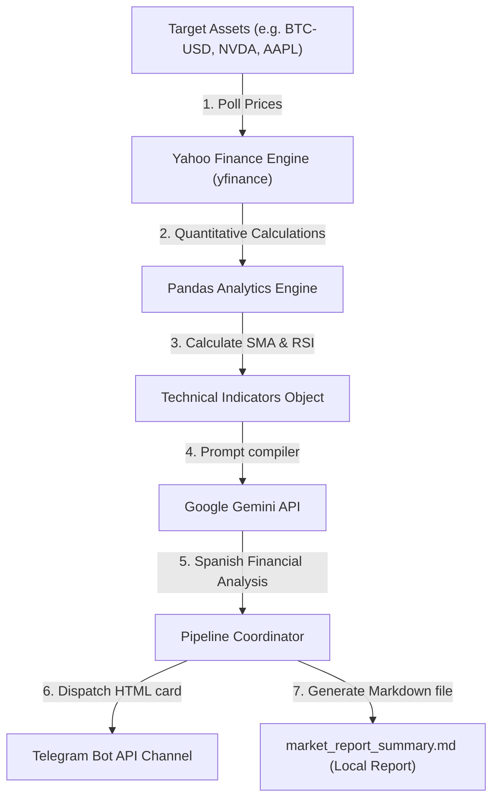

# 📈 AI Technical Analyst & Market Intelligence Bot

A premium, quantitative market intelligence agent built in Python. This bot downloads real-time stock or cryptocurrency market historical pricing, calculates critical mathematical technical indicators (Simple Moving Averages & Relative Strength Index), queries Gemini 1.5 to write a professional market analyst report in Spanish, and automatically dispatches styled HTML messages directly to a Telegram channel.

---

## 🛠️ Tech Stack & Key Features

*   **Real-time Financial Polling**: Built on **Yahoo Finance (`yfinance`)** to download live asset intervals dynamically.
*   **Quantitative Analytics Engine**: Powered by **Pandas** to compute mathematical **SMA-20** trend indicators and rolling **RSI-14** oscillators.
*   **Cognitive AI Report Writer**: Interfaced with the **Google Gemini API** (`gemini-1.5-flash`) using technical prompt engineering.
*   **Automated Messenger Dispatcher**: Connected to the **Telegram Bot HTTP API** to route styled HTML messages containing bold metrics and emojis.
*   **Offline Markdown compiler**: Automatically writes a clean `market_report_summary.md` on every run, letting recruiters inspect technical outputs offline instantly.

---

## 📐 Architecture Workflow



---

## 🚀 How to Install and Run

### 1. Configure the Environment
Open a terminal in this directory and create a virtual environment:
```bash
python3 -m venv venv
source venv/bin/activate
pip install -r requirements.txt
```

### 2. Set Up Credentials (Optional)
Create a `.env` file in the root folder:
```env
GEMINI_API_KEY=your_gemini_api_key_here
TELEGRAM_BOT_TOKEN=your_telegram_bot_token_here
TELEGRAM_CHAT_ID=your_target_telegram_chat_id_here
```
*(If no Telegram or Gemini API credentials are provided, the system successfully falls back to stdout visual logging and compiles a localized Markdown report file `market_report_summary.md` immediately, working 100% out of the box).*

### 3. Launch the Pipeline
```bash
python main.py
```

---

## 📋 Example Telegram Output

📊 **<u>REPORTE TÉCNICO DIARIO: BTC-USD</u>**

💰 **Precio Actual**: $68245.22 (🟢 1.45%)
📈 **Máx 24h**: $68500.00 | 📉 **Mín 24h**: $67900.00

📐 **MÉTRICAS CLAVE:**
• **Medio Móvil SMA-20**: $66120.40 🚀
• **Fuerza Relativa RSI-14**: 58.4

🧠 **ANÁLISIS COGNITIVO IA:**
*"El activo BTC-USD cotiza por encima de su media móvil de 20 períodos, consolidando una tendencia alcista en el gráfico de 1 día. El oscilador RSI en 58.4 refleja una fase neutral de consolidación sin señales de sobrecompra extrema. Se aconseja vigilar rupturas por encima de los $68,500 antes de abrir posiciones adicionales."*

🌐 *Enviado por AI Analyst Bot Portfolio*

---

## 👤 Developer Profile
Created as part of a Python Automation portfolio for independent remote contracts.
👉 *LinkedIn: [Facundo Pavon](https://linkedin.com)*
👉 *GitHub: [@fpavon2005](https://github.com/fpavon2005)*
